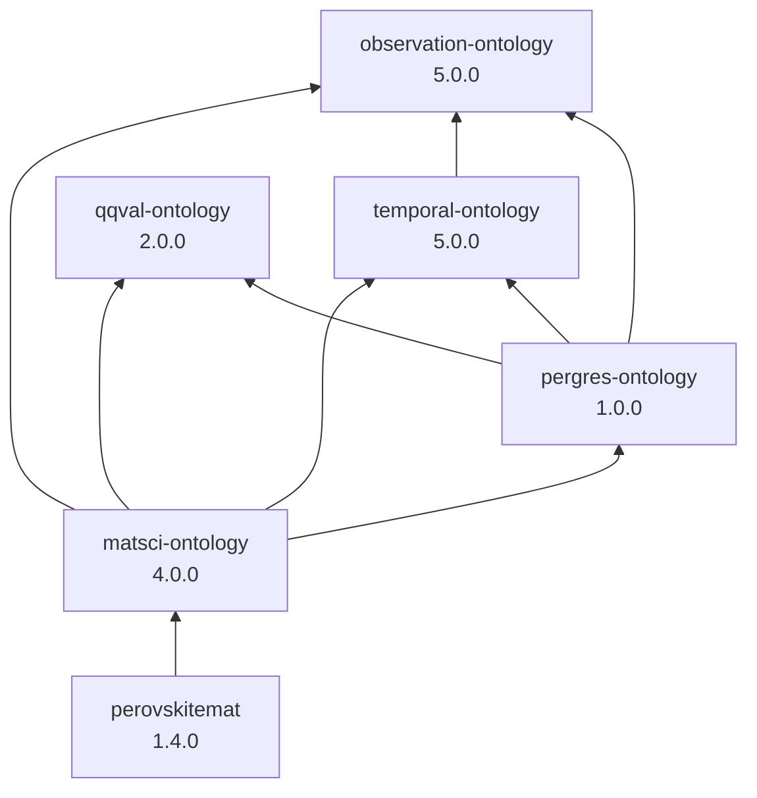

# Domain Ontologies

OWL vocabularies for materials-science and perovskite research, factored into
reusable layers. Domain-independent modules (observation, temporal, qualified
quantities) sit below the materials-science and perovskite-specific layers;
`pergres-ontology` bridges qqval qualification across observation and temporal.

## Ontology graph

`owl:imports` between the ontologies in this collection (arrows point from
importer → importee). External dependencies (SOSA, BFO, QUDT, SSN, unit
vocabularies) are omitted.



**Dependency order** (load or reason over ontologies in this sequence):

1. `qqval-ontology`
2. `observation-ontology`
3. `temporal-ontology`
4. `pergres-ontology`
5. `matsci-ontology`
6. `perovskitemat`

`qqval-ontology` and `observation-ontology` are independent of each other.
`temporal-ontology` specializes observation only (not qqval). Cross-module
qqval-qualification policy lives exclusively in `pergres-ontology`.

## Ontologies

### Qualified Quantity Value (`qqval-ontology`)

| | |
|---|---|
| **File** | [`qqval-ontology.ttl`](ontologies/qqval-ontology.ttl) |
| **Shapes** | [`qqval-shapes.ttl`](shapes/qqval-shapes.ttl) |
| **Prefix** | `qqval:` → `https://growgraph.dev/ontologies/qqval-ontology#` |
| **Version** | 2.0.0 |

Reusable vocabulary for quantitative values whose numeric component carries
an epistemic qualifier (`Exact` / `Approximate`). Numeric form (scalar,
range, one-sided bound) and uncertainty presence are inferred from which
properties are populated. Bound inclusivity is controlled by
`lowerBoundInclusive` / `upperBoundInclusive`. Standalone — imports only
QUDT/units.

### Observation (`observation-ontology`)

| | |
|---|---|
| **File** | [`observation-ontology.ttl`](ontologies/observation-ontology.ttl) |
| **Shapes** | [`observation-shapes.ttl`](shapes/observation-shapes.ttl) |
| **Prefix** | `obs:` → `https://growgraph.dev/ontologies/observation-ontology#` |
| **Version** | 5.0.0 |

Domain-independent scaffolding for processes, observations, phenomena, and
conditions. Grounded in SOSA/BFO. Quantitative results are
`qudt:QuantityValue`; optional qqval tightening is in `pergres-ontology`.
Does not import qqval. Provenance: use `dcterms:source` to an RDF resource.

### Temporal (`temporal-ontology`)

| | |
|---|---|
| **File** | [`temporal-ontology.ttl`](ontologies/temporal-ontology.ttl) |
| **Shapes** | [`temporal-shapes.ttl`](shapes/temporal-shapes.ttl) |
| **Prefix** | `tempo:` → `https://growgraph.dev/ontologies/temporal-ontology#` |
| **Version** | 5.0.0 |

Domain-independent vocabulary for process duration, entity aging, storage,
exposure, and time-resolved characterization. Specializes
`observation-ontology`. `tempo:TimeQuantityValue` is a bare
`qudt:QuantityValue`; optional subclassing under
`qqval:QualifiedQuantityValue` is asserted by `pergres-ontology`.

### Pergres bridge (`pergres-ontology`)

| | |
|---|---|
| **File** | [`pergres-ontology.ttl`](ontologies/pergres-ontology.ttl) |
| **Shapes** | [`pergres-shapes.ttl`](shapes/pergres-shapes.ttl) |
| **Prefix** | `pergres:` → `https://growgraph.dev/ontologies/pergres-ontology#` |
| **Version** | 1.0.0 |

Opinionated bridge that makes qqval-qualification mandatory for quantitative
observation results and temporal quantity values. Imports qqval, observation,
and temporal. Domain consumers that want that policy (e.g. matsci) import
this module; others can omit it.

### Material Science (`matsci-ontology`)

| | |
|---|---|
| **File** | [`matsci-ontology.ttl`](ontologies/matsci-ontology.ttl) |
| **Shapes** | [`matsci-shapes.ttl`](shapes/matsci-shapes.ttl) |
| **Prefix** | `matsci:` → `https://growgraph.dev/ontologies/matsci-ontology#` |
| **Version** | 4.0.0 |

General materials-science vocabulary (materials, samples, synthesis,
characterization, morphology, properties). Imports observation, temporal,
qqval, and pergres. `matsci:hasInputSample`/`hasOutputSample` are
`sosa:Sample`-narrowed convenience subproperties of
`observation-ontology`'s `hasInputEntity`/`hasOutputEntity`.

### Perovskite (`perovskitemat`)

| | |
|---|---|
| **File** | [`perovskitemat.ttl`](ontologies/perovskitemat.ttl) |
| **Prefix** | `perovmat:` → `https://growgraph.dev/ontologies/perovskitemat#` |
| **Version** | 1.4.0 |

Perovskite-specific classes and individuals (composition sites, halide
perovskites, named compounds). Imports `matsci-ontology` only.

## Validation

`qqval-shapes.ttl`, `observation-shapes.ttl`, `temporal-shapes.ttl`,
`pergres-shapes.ttl`, and `matsci-shapes.ttl` are SHACL shapes graphs that
mirror the OWL cardinality/qualifier restrictions declared in the
corresponding ontology (plus, for `matsci-shapes.ttl`, a small curated
closed-world type-sanity net), for closed-world validation of extracted
data. Validate a data graph with, e.g.,
[`pyshacl`](https://github.com/RDFLib/pySHACL):

```bash
pyshacl -s qqval-shapes.ttl -s observation-shapes.ttl \
        -s temporal-shapes.ttl -s pergres-shapes.ttl -s matsci-shapes.ttl \
        -d qqval-ontology.ttl -d observation-ontology.ttl \
        -d temporal-ontology.ttl -d pergres-ontology.ttl \
        -d matsci-ontology.ttl -d <data.ttl> \
        -i rdfs -a
```

(the `-d <ontology>.ttl` inputs give the validator the named-individual
typing — e.g. `qqval:Exact a qqval:EpistemicQualifier` — that `sh:class`
constraints rely on. `-i rdfs` is required: `temporal-ontology`'s
`tempo:hasTemporalQuantityResult`/`hasEntityTemporalStateResult` are
`rdfs:subPropertyOf` `observation-ontology`'s `hasQuantityResult`/
`hasQualitativeResult`, and only asserting the more specific `tempo:` triple
— the extraction-pipeline-expected behavior — otherwise fails
`observation-shapes.ttl`'s class-level checks, since SHACL does not follow
`rdfs:subPropertyOf` without an inference pass.)

## Design notes

See [`planning/modularization.md`](planning/modularization.md) for the
dependency-graph rationale and expert-review verdicts behind the current
layering.

## Contributing

Bump `owl:versionInfo` (and `owl:versionIRI` when present) in the ontology
header when you change a vocabulary. Update this README and
[`CHANGELOG.md`](CHANGELOG.md) for notable releases. Ontology headers carry
current-state descriptions only — history belongs in the changelog.
