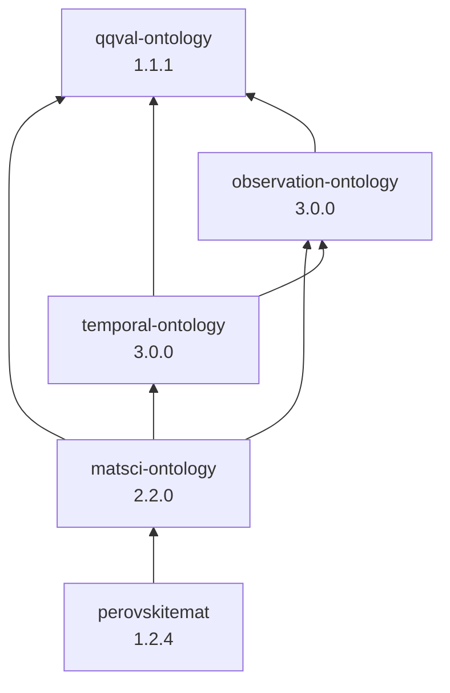

# Domain Ontologies

OWL vocabularies for materials-science and perovskite research, factored into
reusable layers. Domain-independent scaffolding (observation, temporal,
qualified quantities) sits below the materials-science and perovskite-specific
layers.

## Ontology graph

`owl:imports` between the ontologies in this collection (arrows point from
importer → importee). External dependencies (SOSA, BFO, QUDT, SSN, unit
vocabularies) are omitted.

**Dependency order** (load or reason over ontologies in this sequence):

1. `qqval-ontology`
2. `observation-ontology`
3. `temporal-ontology`
4. `matsci-ontology`
5. `perovskitemat`

`temporal-ontology` and `matsci-ontology` are siblings: temporal depends only on
observation (and qqval), not on matsci, so the graph stays acyclic.

## Ontologies

### Qualified Quantity Value (`qqval-ontology`)

| | |
|---|---|
| **File** | [`qqval-ontology.ttl`](qqval-ontology.ttl) |
| **Prefix** | `qqval:` → `https://growgraph.dev/ontologies/qqval-ontology#` |
| **Version** | 1.1.1 |

Reusable vocabulary for quantitative values whose numeric component carries an
epistemic qualifier (exact, approximate, range, one-sided bound, uncertainty).
Imported by every other ontology in this collection that reports quantities.

### Observation (`observation-ontology`)

| | |
|---|---|
| **File** | [`observation-ontology.ttl`](observation-ontology.ttl) |
| **Prefix** | `obs:` → `https://growgraph.dev/ontologies/observation-ontology#` |
| **Version** | 3.0.0 |

Domain-independent scaffolding for processes, observations, phenomena, and
environment conditions. Grounded in SOSA/BFO. Nucleated out of
`matsci-ontology`; formerly named `experiment-ontology` (`exp:`), before that
`core-ontology` (`core:`).

### Temporal (`temporal-ontology`)

| | |
|---|---|
| **File** | [`temporal-ontology.ttl`](temporal-ontology.ttl) |
| **Prefix** | `tempo:` → `https://growgraph.dev/ontologies/temporal-ontology#` |
| **Version** | 3.0.0 |

Domain-independent vocabulary for process duration, sample aging, storage,
exposure, and time-resolved characterization. Specializes
`observation-ontology`; does not import `matsci-ontology`.
Matsci/spectroscopy-specific temporal terms live in `matsci-ontology`.

### Material Science (`matsci-ontology`)

| | |
|---|---|
| **File** | [`matsci-ontology.ttl`](matsci-ontology.ttl) |
| **Prefix** | `matsci:` → `https://growgraph.dev/ontologies/matsci-ontology#` |
| **Version** | 2.2.0 |

General materials-science vocabulary (materials, samples, synthesis,
characterization, morphology, properties). Split from the original perovskite
ontology; layers on top of `observation-ontology` and imports
`temporal-ontology` for temporal typing of matsci-native terms.

### Perovskite (`perovskitemat`)

| | |
|---|---|
| **File** | [`perovskitemat.ttl`](perovskitemat.ttl) |
| **Prefix** | `perovmat:` → `https://growgraph.dev/ontologies/perovskitemat#` |
| **Version** | 1.2.4 |

Perovskite-specific classes and individuals (composition sites, halide
perovskites, named compounds). Imports `matsci-ontology` only.

## Contributing

Bump `owl:versionInfo` (and `owl:versionIRI` when present) in the ontology
header when you change a vocabulary. Update this README and
[`CHANGELOG.md`](CHANGELOG.md) for notable releases.
