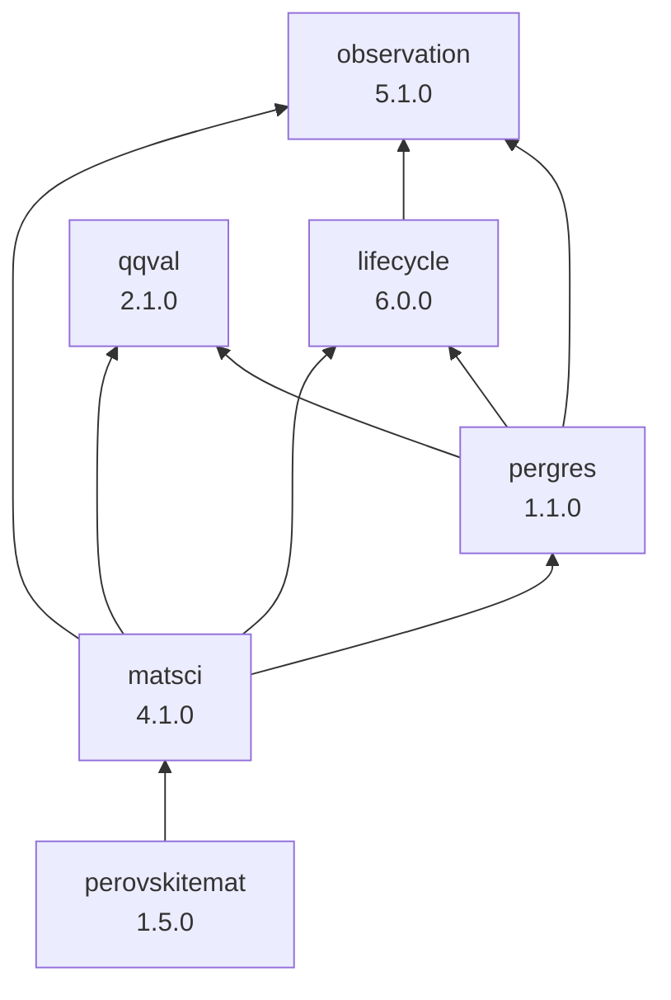

# Domain Ontologies

OWL vocabularies for materials-science and perovskite research, factored into
reusable layers. Domain-independent modules (observation, lifecycle, qualified
quantities) sit below the materials-science and perovskite-specific layers;
`pergres` bridges qqval qualification across observation and lifecycle.

## Ontology graph

`owl:imports` between the ontologies in this collection (arrows point from
importer → importee). External dependencies (SOSA, BFO, QUDT, SSN, unit
vocabularies) are omitted.


```mermaid
graph BT
    perov["perovskitemat<br/>1.5.0"]
    matsci["matsci<br/>4.1.0"]
    pergres["pergres<br/>1.1.0"]
    life["lifecycle<br/>6.0.0"]
    obs["observation<br/>5.1.0"]
    qqval["qqval<br/>2.1.0"]

    perov --> matsci
    matsci --> life
    matsci --> obs
    matsci --> qqval
    matsci --> pergres
    life --> obs
    pergres --> qqval
    pergres --> obs
    pergres --> life
```

**Dependency order** (load or reason over ontologies in this sequence):

1. `qqval`
2. `observation`
3. `lifecycle`
4. `pergres`
5. `matsci`
6. `perovskitemat`

`qqval` and `observation` are independent of each other.
`lifecycle` specializes observation only (not qqval). Cross-module
qqval-qualification policy lives exclusively in `pergres`.

## Ontologies

### Qualified Quantity Value (`qqval`)

| | |
|---|---|
| **File** | [`qqval.ttl`](ontologies/qqval.ttl) |
| **Shapes** | [`qqval-shapes.ttl`](shapes/qqval-shapes.ttl) |
| **Prefix** | `qqval:` → `https://growgraph.dev/ontologies/qqval#` |
| **Version** | 2.1.0 |

Reusable vocabulary for quantitative values whose numeric component carries
an epistemic qualifier (`Exact` / `Approximate`). Numeric form (scalar,
range, one-sided bound) and uncertainty presence are inferred from which
properties are populated. Bound inclusivity is controlled by
`lowerBoundInclusive` / `upperBoundInclusive`. Standalone — imports only
QUDT/units.

### Observation (`observation`)

| | |
|---|---|
| **File** | [`observation.ttl`](ontologies/observation.ttl) |
| **Shapes** | [`observation-shapes.ttl`](shapes/observation-shapes.ttl) |
| **Prefix** | `obs:` → `https://growgraph.dev/ontologies/observation#` |
| **Version** | 5.1.0 |

Domain-independent scaffolding for processes, observations, phenomena, and
conditions. Grounded in SOSA/BFO. Quantitative results are
`qudt:QuantityValue`; optional qqval tightening is in `pergres`.
Does not import qqval. Provenance: use `dcterms:source` to an RDF resource.

### Lifecycle (`lifecycle`)

| | |
|---|---|
| **File** | [`lifecycle.ttl`](ontologies/lifecycle.ttl) |
| **Shapes** | [`lifecycle-shapes.ttl`](shapes/lifecycle-shapes.ttl) |
| **Prefix** | `life:` → `https://growgraph.dev/ontologies/lifecycle#` |
| **Version** | 6.0.0 |

Domain-independent module with two orthogonal concerns under one namespace:

- **Temporal quantities / measurement** — duration, elapsed time, delay,
  ordering, transient response (`TemporalObservation`,
  `ObservableTemporalProperty`, `TimeQuantityValue`, …)
- **Entity lifecycle** — post-creation processes (storage, exposure,
  operation, aging) and categorical entity state (`LifecycleProcess`,
  `EntityLifecycleState`, `QualitativeEntityLifecycleObservation`)

Specializes `observation`. `life:TimeQuantityValue` is a bare
`qudt:QuantityValue`; optional subclassing under
`qqval:QualifiedQuantityValue` is asserted by `pergres`. The prefix
`life:` names the module, not every term's semantic category
(so `life:TemporalObservation` is intentional).

### Pergres bridge (`pergres`)

| | |
|---|---|
| **File** | [`pergres.ttl`](ontologies/pergres.ttl) |
| **Shapes** | [`pergres-shapes.ttl`](shapes/pergres-shapes.ttl) |
| **Prefix** | `pergres:` → `https://growgraph.dev/ontologies/pergres#` |
| **Version** | 1.1.0 |

Opinionated bridge that makes qqval-qualification mandatory for quantitative
observation results and temporal quantity values. Imports qqval, observation,
and lifecycle. Domain consumers that want that policy (e.g. matsci) import
this module; others can omit it.

### Material Science (`matsci`)

| | |
|---|---|
| **File** | [`matsci.ttl`](ontologies/matsci.ttl) |
| **Shapes** | [`matsci-shapes.ttl`](shapes/matsci-shapes.ttl) |
| **Prefix** | `matsci:` → `https://growgraph.dev/ontologies/matsci#` |
| **Version** | 4.1.0 |

General materials-science vocabulary (materials, samples, synthesis,
characterization, morphology, properties). Imports observation, lifecycle,
qqval, and pergres. `matsci:hasInputSample`/`hasOutputSample` are
`sosa:Sample`-narrowed convenience subproperties of
`observation`'s `hasInputEntity`/`hasOutputEntity`.

### Perovskite (`perovskitemat`)

| | |
|---|---|
| **File** | [`perovskitemat.ttl`](ontologies/perovskitemat.ttl) |
| **Prefix** | `perovmat:` → `https://growgraph.dev/ontologies/perovskitemat#` |
| **Version** | 1.5.0 |

Perovskite-specific classes and individuals (composition sites, halide
perovskites, named compounds). Imports `matsci` only.

## Validation

`qqval-shapes.ttl`, `observation-shapes.ttl`, `lifecycle-shapes.ttl`,
`pergres-shapes.ttl`, and `matsci-shapes.ttl` are SHACL shapes graphs that
mirror the OWL cardinality/qualifier restrictions declared in the
corresponding ontology (plus, for `matsci-shapes.ttl`, a small curated
closed-world type-sanity net), for closed-world validation of extracted
data. Validate a data graph with, e.g.,
[`pyshacl`](https://github.com/RDFLib/pySHACL):

```bash
pyshacl -s qqval-shapes.ttl -s observation-shapes.ttl \
        -s lifecycle-shapes.ttl -s pergres-shapes.ttl -s matsci-shapes.ttl \
        -d qqval.ttl -d observation.ttl \
        -d lifecycle.ttl -d pergres.ttl \
        -d matsci.ttl -d <data.ttl> \
        -i rdfs -a
```

(the `-d <ontology>.ttl` inputs give the validator the named-individual
typing — e.g. `qqval:Exact a qqval:EpistemicQualifier` — that `sh:class`
constraints rely on. `-i rdfs` is required: `lifecycle`'s
`life:hasTemporalQuantityResult`/`hasEntityLifecycleStateResult` are
`rdfs:subPropertyOf` `observation`'s `hasQuantityResult`/
`hasQualitativeResult`, and only asserting the more specific `life:` triple
— the extraction-pipeline-expected behavior — otherwise fails
`observation-shapes.ttl`'s class-level checks, since SHACL does not follow
`rdfs:subPropertyOf` without an inference pass.)

## Design notes

See [`planning/modularization.md`](planning/modularization.md) for the
dependency-graph rationale and expert-review verdicts behind the current
layering.

## Contributing

Bump `owl:versionInfo` (and `owl:versionIRI` when present) in the ontology
header when you change a vocabulary. Update this README and
[`CHANGELOG.md`](CHANGELOG.md) for notable releases. Ontology headers carry
current-state descriptions only — history belongs in the changelog.
