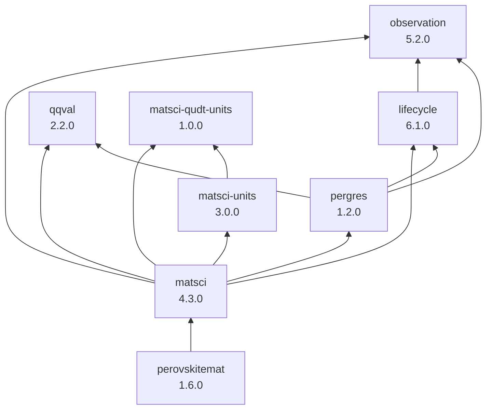

# Domain Ontologies

OWL vocabularies for materials-science and perovskite research, factored into
reusable layers. Domain-independent modules (observation, lifecycle, qualified
quantities) sit below the materials-science and perovskite-specific layers;
`pergres` bridges qqval qualification across observation and lifecycle.

## Ontology graph

`owl:imports` between the ontologies in this collection (arrows point from
importer → importee). External dependencies (SOSA, BFO, SSN, and QUDT's schema
facade and unit vocabulary) are omitted.


```mermaid
graph BT
    perov["perovskitemat<br/>1.6.0"]
    matsci["matsci<br/>4.3.0"]
    pergres["pergres<br/>1.2.0"]
    life["lifecycle<br/>6.1.0"]
    obs["observation<br/>5.2.0"]
    qqval["qqval<br/>2.2.0"]
    units["matsci-units<br/>3.0.0"]
    qudtunits["matsci-qudt-units<br/>1.0.0"]

    perov --> matsci
    matsci --> life
    matsci --> obs
    matsci --> qqval
    matsci --> pergres
    matsci --> units
    matsci --> qudtunits
    units --> qudtunits
    life --> obs
    pergres --> qqval
    pergres --> obs
    pergres --> life
```

**Dependency order** (load or reason over ontologies in this sequence):

1. `qqval`
2. `observation`
3. `lifecycle`
4. `pergres`
5. `matsci-qudt-units`
6. `matsci-units`
7. `matsci`
8. `perovskitemat`

`qqval`, `observation` and `matsci-qudt-units` are independent of each other.
`lifecycle` specializes observation only (not qqval). Cross-module
qqval-qualification policy lives exclusively in `pergres`.

## Ontologies

### Qualified Quantity Value (`qqval`)

| | |
|---|---|
| **File** | [`qqval.ttl`](ontologies/qqval.ttl) |
| **Shapes** | [`qqval-shapes.ttl`](shapes/qqval-shapes.ttl) |
| **Prefix** | `qqval:` → `https://growgraph.dev/ontologies/qqval#` |
| **Version** | 2.2.0 |

Reusable vocabulary for quantitative values whose numeric component carries
an epistemic qualifier (`Exact` / `Approximate`). Numeric form (scalar,
range, one-sided bound) and uncertainty presence are inferred from which
properties are populated. Bound inclusivity is controlled by
`lowerBoundInclusive` / `upperBoundInclusive`. Standalone — imports only the
QUDT schema facade and QUDT's unit vocabulary (not `matsci-units` or
`matsci-qudt-units`, which are project-scoped and sit above it).

### Observation (`observation`)

| | |
|---|---|
| **File** | [`observation.ttl`](ontologies/observation.ttl) |
| **Shapes** | [`observation-shapes.ttl`](shapes/observation-shapes.ttl) |
| **Prefix** | `obs:` → `https://growgraph.dev/ontologies/observation#` |
| **Version** | 5.2.0 |

Domain-independent scaffolding for processes, observations, phenomena, and
conditions. Grounded in SOSA/BFO. Quantitative results are
`qudt:QuantityValue`; optional qqval tightening is in `pergres`.
Does not import qqval. Provenance: use `dcterms:source` to an RDF resource.

### Lifecycle (`lifecycle`)

| | |
|---|---|
| **File** | [`lifecycle.ttl`](ontologies/lifecycle.ttl) |
| **Shapes** | [`lifecycle-shapes.ttl`](shapes/lifecycle-shapes.ttl) |
| **Prefix** | `life:` → `https://growgraph.dev/ontologies/lifecycle#` |
| **Version** | 6.1.0 |

Domain-independent module with two orthogonal concerns under one namespace:

- **Temporal quantities / measurement** — duration, elapsed time, delay,
  ordering, transient response (`TemporalObservation`,
  `ObservableTemporalProperty`, `TimeQuantityValue`, …)
- **Entity lifecycle** — post-creation processes (storage, exposure,
  operation, aging) and categorical entity state (`LifecycleProcess`,
  `EntityLifecycleState`, `QualitativeEntityLifecycleObservation`)

Specializes `observation`. `life:TimeQuantityValue` is a bare
`qudt:QuantityValue`; optional subclassing under
`qqval:QualifiedQuantityValue` is asserted by `pergres`. The prefix
`life:` names the module, not every term's semantic category
(so `life:TemporalObservation` is intentional).

### Pergres bridge (`pergres`)

| | |
|---|---|
| **File** | [`pergres.ttl`](ontologies/pergres.ttl) |
| **Shapes** | [`pergres-shapes.ttl`](shapes/pergres-shapes.ttl) |
| **Prefix** | `pergres:` → `https://growgraph.dev/ontologies/pergres#` |
| **Version** | 1.2.0 |

Opinionated bridge that makes qqval-qualification mandatory for quantitative
observation results and temporal quantity values. Imports qqval, observation,
and lifecycle. Domain consumers that want that policy (e.g. matsci) import
this module; others can omit it.

### Units (`matsci-units`)

| | |
|---|---|
| **File** | [`matsci-units.ttl`](ontologies/matsci-units.ttl) |
| **Shapes** | — (named individuals only; no constraints to mirror) |
| **Prefix** | `matsciunits:` → `https://growgraph.dev/ontologies/matsci-units#` |
| **Version** | 3.0.0 |

Units the matsci corpus reports that **QUDT does not define**. QUDT is the
canonical source for units here: units it already defines are used under their own QUDT
IRIs, with no local alias and no `owl:sameAs` bridge, so this module is not a
unit vocabulary and does not restate one.

QUDT mints prefixed units as individual terms rather than deriving them
compositionally, so the milli/micro forms of its compound units are simply
absent. Seven terms, each verified missing from QUDT 2.1 *and* 3.1.4:

| Term | Symbol | Why the corpus needs it |
|---|---|---|
| `millielectronvolt` | meV | exciton binding energy, Urbach energy, band offsets |
| `milliamperePerSquareCentimetre` | mA/cm² | short-circuit current density (Jsc) |
| `milliwattPerSquareCentimetre` | mW/cm² | illumination intensity; 1 sun = 100 mW/cm² |
| `microjoulePerSquareCentimetre` | µJ/cm² | excitation fluence (TA, superfluorescence) |
| `millijoulePerSquareCentimetre` | mJ/cm² | excitation fluence, upper range |
| `sun` | sun | illumination as AM1.5G multiples |
| `arbitraryUnit` | a.u. | normalized intensity with no absolute scale |

`unit:UNITLESS` is not a substitute for `a.u.`: it means
dimensionless-*but-absolute*, and its QUDT symbol is the CJK ideograph U+4E00.

Each term mirrors QUDT's own minting pattern — `qudt:prefix`, `qudt:scalingOf`,
conversion multiplier, quantity kind, dimension vector — so it can be proposed
upstream and retired if accepted.

The QUDT units this corpus *does* use are vendored in
[`matsci-qudt-units.ttl`](ontologies/matsci-qudt-units.ttl); that is the
dependency to load, not QUDT itself.

Both unit modules are **project-scoped by name**. Which units are missing from
QUDT, and which QUDT units are worth vendoring, are both properties of *what a
corpus measures* — a sibling project reporting different quantities adds its own
`<project>-units` and `<project>-qudt-units` rather than widening these.

### QUDT projection (`matsci-qudt-units`)

| | |
|---|---|
| **File** | [`matsci-qudt-units.ttl`](ontologies/matsci-qudt-units.ttl) (generated) |
| **Generator** | [`scripts/build_qudt_subset.py`](scripts/build_qudt_subset.py) |
| **Shapes** | — (vendored third-party terms; nothing to constrain) |
| **Prefix** | `unit:`, `quantitykind:` → QUDT's own namespaces (mints none of its own) |
| **Version** | 1.0.0 (from QUDT 3.1.4) |

The matsci projection of QUDT: **72 units** this corpus reports plus the **32
quantity kinds** they belong to. Terms keep their QUDT IRIs and definitions —
nothing is aliased, renamed, or re-minted.

This file exists because **tooling that does not dereference `owl:imports` sees
no QUDT terms at all** (see [Consuming these ontologies](#consuming-these-ontologies)).
Declaring the dependency is not the same as satisfying it, and a pipeline asked
to cite QUDT IRIs it has never seen will invent them — QUDT's naming is not
guessable (`unit:NanoM`, not `unit:NM`; `unit:DEG_C`; `unit:PER-CentiM`;
`unit:W-PER-CentiM2`).

The full QUDT unit vocabulary (2839 units) is deliberately **not** vendored: it
would outweigh the entire domain vocabulary and crowd it out of any bounded
retrieval context.

Two adjustments are made to the vendored terms, both additive:

- **Corpus-idiomatic spellings.** QUDT writes micro as U+03BC (GREEK SMALL
  LETTER MU) while papers use U+00B5 (MICRO SIGN), and writes wavenumber as
  `/cm` where papers write `cm⁻¹`. Extra `qudt:symbol` / `skos:notation`
  literals are attached to the QUDT IRI itself, never as a competing individual.
- **Noise removed.** QUDT's multilingual labels (up to 23 per term) are filtered
  to English, and its encyclopedia-length `dcterms:description` and LaTeX
  glosses are dropped.

Regenerate after editing the curated lists:

```bash
uv run --with rdflib python scripts/build_qudt_subset.py
```

The script reports dropped quantity kinds, allowlist entries that matched
nothing, and any term kept without a label, so the curation stays auditable.

### Material Science (`matsci`)

| | |
|---|---|
| **File** | [`matsci.ttl`](ontologies/matsci.ttl) |
| **Shapes** | [`matsci-shapes.ttl`](shapes/matsci-shapes.ttl) |
| **Prefix** | `matsci:` → `https://growgraph.dev/ontologies/matsci#` |
| **Version** | 4.3.0 |

General materials-science vocabulary (materials, samples, synthesis,
characterization, morphology, properties). Imports observation, lifecycle,
qqval, pergres, matsci-units, and matsci-qudt-units. `matsci:hasInputSample`/`hasOutputSample` are
`sosa:Sample`-narrowed convenience subproperties of
`observation`'s `hasInputEntity`/`hasOutputEntity`.

### Perovskite (`perovskitemat`)

| | |
|---|---|
| **File** | [`perovskitemat.ttl`](ontologies/perovskitemat.ttl) |
| **Prefix** | `perovmat:` → `https://growgraph.dev/ontologies/perovskitemat#` |
| **Version** | 1.6.0 |

Perovskite-specific classes and individuals (composition sites, halide
perovskites, named compounds). Imports `matsci` only.

## Validation

`qqval-shapes.ttl`, `observation-shapes.ttl`, `lifecycle-shapes.ttl`,
`pergres-shapes.ttl`, and `matsci-shapes.ttl` are SHACL shapes graphs that
mirror the OWL cardinality/qualifier restrictions declared in the
corresponding ontology (plus, for `matsci-shapes.ttl`, a small curated
closed-world type-sanity net), for closed-world validation of extracted
data. `matsci-units` has no shapes graph: it declares named individuals only,
so there are no constraints to mirror, and `matsci-qudt-units` vendors
third-party terms verbatim.

Validate a data graph with [`pyshacl`](https://github.com/RDFLib/pySHACL). It
takes one shapes graph and one data graph, so concatenate each set first
(Turtle allows repeated prefix declarations, so plain `cat` is safe):

```bash
cat shapes/*.ttl > /tmp/shapes.ttl
cat ontologies/*.ttl <data.ttl> > /tmp/data.ttl
pyshacl -s /tmp/shapes.ttl -i rdfs -a /tmp/data.ttl
```

(the ontology files in the data graph give the validator the named-individual
typing — e.g. `qqval:Exact a qqval:EpistemicQualifier` — that `sh:class`
constraints rely on. `-i rdfs` is required: `lifecycle`'s
`life:hasTemporalQuantityResult`/`hasEntityLifecycleStateResult` are
`rdfs:subPropertyOf` `observation`'s `hasQuantityResult`/
`hasQualitativeResult`, and only asserting the more specific `life:` triple
— the extraction-pipeline-expected behavior — otherwise fails
`observation-shapes.ttl`'s class-level checks, since SHACL does not follow
`rdfs:subPropertyOf` without an inference pass.)

## Consuming these ontologies

These modules are authored against two different contracts. A reasoner or
`pyshacl` resolves `owl:imports` and sees one merged graph. **OntoCast does
not** — it treats every `.ttl` in its ontology directory as an independent
ontology with its own IRI, hash, named graph, and vector-atom partition. Several
properties follow that are not discoverable from the Turtle itself:

- **`owl:imports` is never dereferenced.** The dependency graph above is a
  source-and-reasoning concern, not a runtime one. This is why the QUDT units
  the corpus uses are vendored in
  [`matsci-qudt-units.ttl`](ontologies/matsci-qudt-units.ttl)
  rather than merely imported.
- **`shapes/` must not be placed in the ontology directory.** Each shapes graph
  carries its own `owl:Ontology` header and would load as an additional
  ontology.
- **Two files must never share one `owl:Ontology` IRI.** Re-indexing deletes all
  vector atoms for an IRI before writing, so same-IRI files silently destroy
  each other's atoms. Any future merged or flattened artifact needs its own IRI
  *and* its own directory.
- **Editing a `.ttl` in place is a no-op** once its IRI is already in the triple
  store; the stored copy wins. Re-ingestion means deleting the ontology or
  wiping the store.

### Annotation conventions

The retrieval behaviour of a term is determined almost entirely by its
annotations, so these are not stylistic preferences:

| Use | For | Why |
|---|---|---|
| `rdfs:label` | the one canonical name | leads the term's embedded text and names it in output |
| `skos:altLabel` | synonyms and spelled-out forms | the only synonym predicate that reaches retrieval |
| `skos:notation` | codes and symbols (`XRD`, `IPA`, `meV`) | feeds the lexical lane, which matches raw source-text tokens |
| `rdfs:comment` | what the term *is*, **≤ ~250 chars** | embedded; longer prose is truncated and displaces structural clues |
| `skos:scopeNote` | usage and normative rules | reaches the extraction prompt but is never embedded |
| this README | design rationale, module contracts | reaches neither |

Three rules worth stating explicitly:

- **Never use `dcterms:alternative`.** It is not a label predicate anywhere in
  the consuming pipeline; values are silently discarded.
- **Front-load `rdfs:comment`** with the discriminating noun phrase, in the words
  a paper would actually use. Only the first ~128 tokens survive embedding.
- **Avoid single-character `skos:notation`.** Matching is case-sensitive against
  raw text, so `"I"` for iodide fires on the pronoun and on roman numerals.
  `perovmat:I` therefore carries `skos:altLabel` only.

## Design notes

The dependency-graph rationale and expert-review verdicts behind the current
layering live in `planning/modularization.md` of the OntoCast workspace that
consumes these ontologies. That file sits outside this repository, so it is
named by path rather than linked.

## Contributing

Bump `owl:versionInfo` (and `owl:versionIRI` when present) in the ontology
header when you change a vocabulary. Update this README and
[`CHANGELOG.md`](CHANGELOG.md) for notable releases. Ontology headers carry
current-state descriptions only — history belongs in the changelog.

`matsci-qudt-units.ttl` is generated — edit
[`scripts/build_qudt_subset.py`](scripts/build_qudt_subset.py) and regenerate,
never the Turtle. Follow the annotation conventions above when adding terms.
